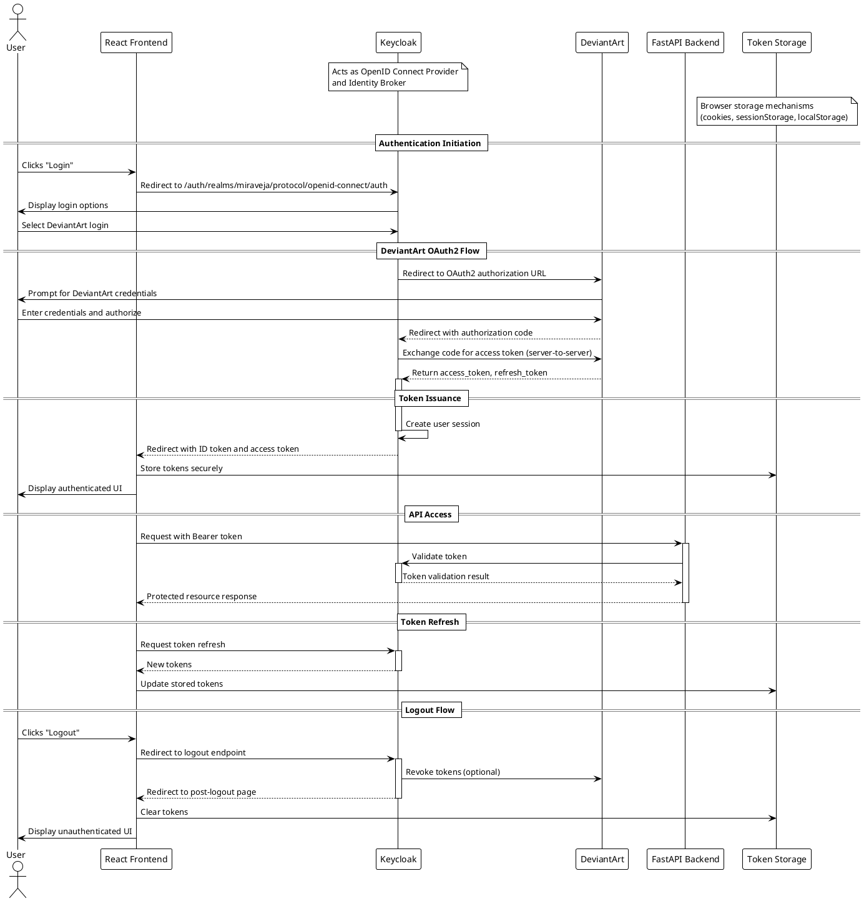

# 🖼️ DeviantArt — Authentication

DeviantArt uses OAuth2 for authentication. In order to make API calls, you must first register your application (after logging in with your DeviantArt account). After you've registered, you'll gain access to a pair of client_id and client_secret codes on the Applications page. You can read the OAuth2 specification at <http://tools.ietf.org/html/rfc6749> and the Bearer Token specification at <http://tools.ietf.org/html/rfc6750>.

## 🔐 OAuth2 Basics

The API supports three of OAuth2's grant types, *Authorization Code*, *Implicit*, and *Client Credentials*. Authorization Code and Client Credentials are used to access private and public endpoints respectively, they have very different authentication flows and are treated as separate authentication methods. Endpoints will document their required authentication method in the Authentication section of the endpoint documentation. Implicit is used for clients that are **public** and cannot protect their client_secret such as Javascript or Mobile clients.

## 🔑 Using the Authorization Code Grant

### 🫴 Authorization Request

Before making API calls for a user, you must ask that user to authorize your application. First you should redirect the user to DeviantArt's authorization URL along with the required query-string parameters below.

```url
https://www.deviantart.com/oauth2/authorize
```

#### 🧩 Parameters

**GET** *response_type* (string) : **REQUIRED** - Setting response_type to code is required. Doing so will include the authorization code in the response. Valid values: code;

**GET** *client_id* (integer) : **REQUIRED** - The client_id you received when you registered your application.

**GET** *redirect_uri* (string) : **REQUIRED** - The URL to which the user will be redirected after authorization. This must match one of the redirect_uris you specified when you registered your application.

**GET** *scope* (string) : **OPTIONAL** - The scope you wish to access (space separated), defaults to basic.

**GET** *state* (string) : **OPTIONAL** - State will be sent back as part of the redirect_uri query parameters, this should be a unique identifier you create to verify the redirect is coming from your original request see <http://tools.ietf.org/html/rfc6749#section-10.12>.

**GET** *view* (string) : **OPTIONAL** - Force authentication view if user is logged out. *login* is the only valid value.

#### 🟢 Successful Response

A successful response means that the user will be redirected to your whitelisted URI along with the following GET parameters.

**GET** *code* (string) - The authorization code you will use to request an access token.

**GET** *state* (string) - The state you provided in the original request.

#### 🛑 Unsuccessful Response

If the authorization request fails for any reason, the user will be redirected back to your whitelisted URI along with the following GET parameters:

**GET** *error* (string) - The error code for the error as defined by the specification see <http://tools.ietf.org/html/rfc6749#section-4.1.2.1>

**GET** *error_description* (string) - A human-readable description of the error.

#### ↩️ Example Authorization Redirect

```text
GET https://www.deviantart.com/oauth2/authorize?response_type=code&client_id=0&redirect_uri=http://myapp.example/cb&scope=basic&state=mysessionid
```

### 📨 Access Token Request

Once you have the code from the authorization step, you can then request an *access_token* to gain access to the API resources. You do this by sending a request to the /token endpoint.

```url
https://www.deviantart.com/oauth2/token
```

#### 🧩 Parameters

**POST**, **GET** *client_id* (integer) : **REQUIRED** - The client_id you received when you registered your application. They can be provided in the request body or as a Basic Auth header.

**POST**, **GET** *client_secret* (string) : **REQUIRED** - Your app's client_secret (obtained during app registration). client_id and client_secret can be provided via HTTP Basic Authentication see <http://tools.ietf.org/html/rfc6750#section-2.1>

**POST**, **GET** *grant_type* (string) : **REQUIRED** - The value must be authorization_code unless you are refreshing a token (see Refreshing An Access Token)

**POST**, **GET** *code* (string) : **REQUIRED** - The code from the authorization step.

**POST**, **GET** *redirect_uri* (string) : **REQUIRED** - The redirect_uri sent with the authorization request to obtain the code, this must exactly match the value sent in that request. This is only required if grant_type is set to authorization_code.

#### 🟢 Successful Response

A successful token request will return a Bearer token in JSON format, see <http://tools.ietf.org/html/rfc6750>.

- Request

```bash
$ curl https://www.deviantart.com/oauth2/token \
    -d grant_type=authorization_code \
    -d client_id=0 \
    -d client_secret=mysecret \
    -d redirect_uri=http://myapp.example/cb \
    -d code=1234
```

- Response

```json
{
  "expires_in": 3600,
  "status": "success",
  "access_token": "Alph4num3r1ct0k3nv4lu3",
  "token_type": "Bearer",
  "refresh_token": "3ul4vn3k0tc1r3mun4hplA",
  "scope": "basic"
}
```

#### 🛑 Unsuccessful Response

- Request

```bash
$ curl https://www.deviantart.com/oauth2/token \
    -d grant_type=authorization_code \
    -d client_id=0 \
    -d client_secret=mysecret \
    -d redirect_uri=http://myapp.example/cb \
    -d code=0
```

- Response

```json
{
   "error":"invalid_request",
   "error_description":"Incorrect authorization code."
}
```

*Please read the [error documentation](https://www.deviantart.com/developers/errors) for detailed error handling guidelines.*

### ♻️ Refreshing An Access Token

All *access_token*'s expire after one hour, after expiration you either need to re-authorize the app or refresh your access token using the *refresh_token* from the /token request.

The *refresh_token* will expire after 3 months, after that time you must re-authorize the app.

```url
https://www.deviantart.com/oauth2/token
```

#### 🧩 Parameters

**POST**, **GET** *client_id* (integer) : **REQUIRED** - Your app's client_id (obtained during app registration). client_id and client_secret can be provided via HTTP Basic Authentication see <http://tools.ietf.org/html/rfc6750#section-2.1>

**POST**, **GET** *client_secret* (string) : **REQUIRED** - Your app's client_secret (obtained during app registration). client_id and client_secret can be provided via HTTP Basic Authentication see <http://tools.ietf.org/html/rfc6750#section-2.1>

**POST**, **GET** *grant_type* (string) : **REQUIRED** - The value must be `refresh_token`.

**POST**, **GET** *refresh_token* (string) : **REQUIRED** - The refresh_token of the Bearer token.

#### 🟢 Successful Response

- Request

```bash
curl https://www.deviantart.com/oauth2/token \
-d grant_type=refresh_token \
-d client_id=0 \
-d client_secret=mysecret \
-d refresh_token="3ul4vn3k0tc1r3mun4hplA"
```

- Response

```json
{
  "expires_in": 3600,
  "status": "success",
  "access_token": "Alph4num3r1ct0k3nv4lu3",
  "token_type": "Bearer"
  "refresh_token": "3ul4vn3k0tc1r3mun4hplA",
  "scope": "basic"
}
```

## 🪪 Using The Client Credentials Grant

### 📨 Access Token Request

To obtain a client access token, you simply request a token using your clients *client_id* and *client_secret*.

```url
https://www.deviantart.com/oauth2/token
```

#### 🧩 Parameters

**POST**, **GET** *client_id* (integer) : **REQUIRED** - Your app's client_id (obtained during app registration). client_id and client_secret can be provided via HTTP Basic Authentication see <http://tools.ietf.org/html/rfc6750#section-2.1>

**POST**, **GET** *client_secret* (string) : **REQUIRED** - Your app's client_secret (obtained during app registration). client_id and client_secret can be provided via HTTP Basic Authentication see <http://tools.ietf.org/html/rfc6750#section-2.1>

**POST**, **GET** *grant_type* (string) : **REQUIRED** - The value must be `client_credentials`.

#### 🟢 Successful Response

A successful token request will return a Bearer token in JSON format, see <http://tools.ietf.org/html/rfc6750>.

- Request

```bash
$ curl https://www.deviantart.com/oauth2/token \
    -d grant_type=client_credentials \
    -d client_id=0 \
    -d client_secret=mysecret
```

- Response

```json
{
  "expires_in": 3600,
  "status": "success",
  "access_token": "Alph4num3r1ct0k3nv4lu3",
  "token_type": "Bearer"
}
```

#### 🛑 Unsuccessful Response

- Request

```bash
$ curl https://www.deviantart.com/oauth2/token \
    -d grant_type=client_credentials \
    -d client_id=0 \
    -d client_secret=mybadsecret
```

```json
{
   "error":"invalid_client",
   "error_description":"Client authentication failed."
}
```

## 🛂 Using The Implicit Grant

### 🫴 Authorization Request

To obtain an access_token using the implicit grant you redirect the user to the authorization url and the access_token will be returned to your client in the fragment of the redirect_uri you provided.

Note that to use the implicit grant you must configure your clients *grant_type* in the clients settings. Implicit clients also require https *redirect_uri*'s and whitelisted uris must exactly match.

```url
https://www.deviantart.com/oauth2/authorize
```

#### 🧩 Parameters

**GET** *response_type* (string) : **REQUIRED** - Setting response_type to token is required. Doing so will include the access_token in the response. Valid values: token;

**GET** *client_id* (integer) : **REQUIRED** - Your app's client_id (obtained during app registration).

**GET** *redirect_uri* (string) : **REQUIRED** - Your app's URI which the user should be redirected to after authorizing. This redirect_uri MUST be in your apps redirect uri whitelist, non-whitelisted uris will be rejected.

**GET** *state* (string) : **REQUIRED** - state will be sent back as part of the redirect_uri query paramerters, this should be a unique identifer you create to verify the redirect is coming from your original request see <http://tools.ietf.org/html/rfc6749#section-10.12>.

**GET** *scope* (string) : **OPTIONAL** - The scope you wish to access (space separated), defaults to basic.

#### 🟢 Successful Response

A successful authorization will redirect the use back to the client with the access_token in the fragment of the url.

- Request:

```text
GET https://www.deviantart.com/oauth2/authorize?response_type=token&client_id=0&redirect_uri=https://myapp.example/cb&scope=basic&state=mysessionid
```

- Response:

```text
GET https://myapp.example/cb#access_token=Alph4num3r1ct0k3nv4lu3&token_type=bearer&expires_in=3600&scope=basic&state=mysessionid
```

#### 🛑 Unsuccessful Response

- Request:

```text
GET https://www.deviantart.com/oauth2/authorize?response_type=token&client_id=-1&redirect_uri=https://myapp.example/cb&scope=basic&state=mysessionid
```

- Response:

```text
GET https://myapp.example/cb?error=invalid_request&error_description=Invalid+client.&state=mysessionid
```

## 📢 Placebo Call

The first and most basic authenticated API call. It checks that a given access_token is still valid. The endpoints are:

```text
https://www.deviantart.com/api/v1/oauth2/placebo
```

### Example

- Request

```bash
curl https://www.deviantart.com/api/v1/oauth2/placebo -d access_token=Alph4num3r1ct0k3nv4lu3
```

- Response

```json
{
  "status": "success"
}
```

### Notes

This call is most useful for checking that an access_token is still valid before making another API call that might take a long time (like a file upload). This way, if a token has expired, your users won't have to wait until the upload (or any other long-running API call) returns an error before your app notices and makes a /token call to refresh the expired token.

## ❌ Revoking Access / Logging Out

Sometimes the user may want to logout or revoke access to the application, in these situations the application may choose to revoke access by itself. Note that if the application provides a means to logout, you should implement this call.

To manually revoke access you can provide either an access_token or refresh_token to identify the user and revoke your applications access to their account. This will revoke all access tokens, refresh tokens and authorizations, meaning applications would need to restart the authorization process to obtain account access again.

The default revoke removes all tokens for the user, if you want to just revoke a single device/session you can pass revoke_refresh_only=true. This will just revoke the refresh_token that is sent in with the revoke request.

```text
POST https://www.deviantart.com/oauth2/revoke
```

### Example

- Request

```bash
curl https://www.deviantart.com/oauth2/revoke -d token=Alph4num3r1ct0k3nv4lu3
```

- Response

```json
{
  "status": "success"
}
```

## References

This document is an extraction and adaptation of the official DeviantArt OAuth2 documentation found at <https://www.deviantart.com/developers/authentication>.

---

## MiraVeja Project Context

The MiraVeja project aims to use the DeviantArt Identity Provider (IdP) for user authentication, as well as the Keycloak service for managing OAuth2/OIDC flows. Below is a comprehensive description of the relevant authentication flows and how they integrate with the MiraVeja architecture.

### Project Characteristics

#### Backend

- Able to safely store secrets (e.g., client_secret).
- Can perform server-to-server communication with the DeviantArt IdP.
- Manages user sessions and tokens securely.

#### Frontend

- Public client that cannot securely store secrets.
- Handles user interactions and redirects for authentication.
- Communicates with the backend for protected resources.

### DeviantArt Authentication Flow



## TL;DR

- **Authorization Endpoint**: `GET https://www.deviantart.com/oauth2/authorize`
  - Kicks off the authentication process by redirecting the user to DeviantArt to grant access.
- **Token Endpoint**: `POST https://www.deviantart.com/oauth2/token`
  - Used to exchange an authorization code for an access token (`grant_type=authorization_code`).
  - Used to get a new access token with a refresh token (`grant_type=refresh_token`).
  - Used to get an app-only access token (`grant_type=client_credentials`).
- **Token Validation Endpoint**: `POST https://www.deviantart.com/api/v1/oauth2/placebo`
  - A simple endpoint to check if an access token is still valid without making a full API call.
- **Token Revocation Endpoint**: `POST https://www.deviantart.com/oauth2/revoke`
  - Invalidates a user's access and refresh tokens, effectively logging them out of the application.
