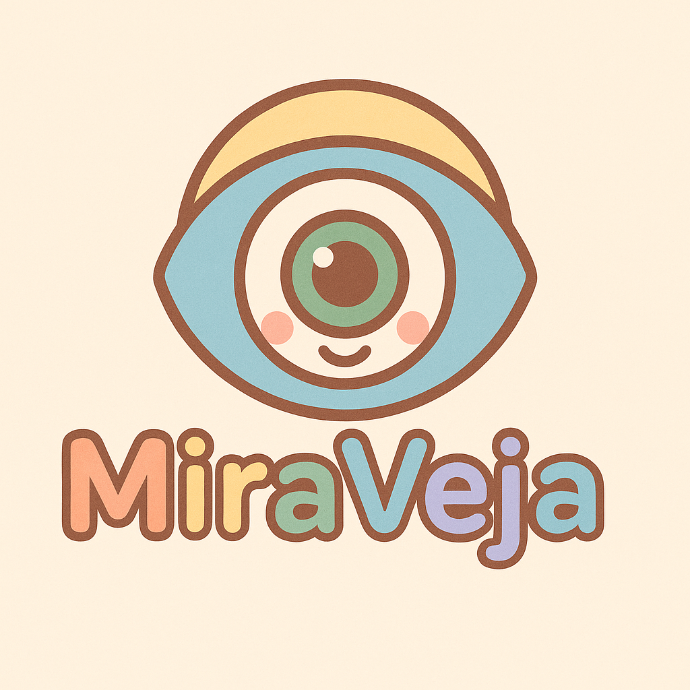

# MiraVeja — Technical Design Document



---

MiraVeja is an **AI-powered image gallery** designed for exploration, inspiration, and creative workflows.  
It allows users to upload, search, and organize images using **vector embeddings**, integrates with external sources (e.g., DeviantArt), supports **SSO authentication**, and lays the foundation for **NFT marketplace features**.  

This document outlines the **architecture, technologies, and workflows** for implementing MiraVeja as a distributed system, starting lean for a solo developer and keeping the design open for future scaling.

## 🧭 Goals

- Build an **open-source, modular system** for learning and experimentation.  
- Start with a **lightweight but extensible stack** (Docker Compose, FastAPI, Postgres, Qdrant, Kafka, Keycloak).  
- Support **DeviantArt SSO** as the first login provider.  
- Enable **vector-based search and recommendations**.  
- Keep design **future-proof** for microservices, scaling, and blockchain integration.

## 🏗️ Architecture Overview

MiraVeja follows a **modular microservices-inspired architecture**, but in early stages it will run as a **set of Docker Compose services**:

- **Core API (FastAPI)** → REST interface for frontend & clients.  
- **Frontend (React/Vue)** → UI for browsing, uploading, searching.  
- **Auth (Keycloak)** → Central identity provider with DeviantArt SSO.  
- **Database (Postgres)** → Asset metadata, users, marketplace.  
- **Object Storage (MinIO)** → Stores uploaded images.  
- **Vector Search (Qdrant)** → ANN search for embeddings.  
- **Message Broker (Kafka)** → Event-driven pipelines (uploads, embeddings).  
- **Worker (Python/Kafka consumer)** → Background processing (thumbnails, moderation, embeddings).

## 🔑 Authentication & Identity

- **Keycloak** will manage authentication and authorization.  
- **DeviantArt SSO** will be configured as the first external Identity Provider.  
- Clients will authenticate using **OIDC PKCE flow**, and services will validate **JWT tokens** issued by Keycloak.  
- Future providers (Google, GitHub, self-hosted credentials) can be added easily.  

## 🗂️ Core Services

### 1. Core API (FastAPI)

- Handles uploads, asset metadata, search requests.  
- Exposes REST endpoints secured by JWT tokens.  
- Writes to Postgres and MinIO.  
- Publishes events to Kafka.  

### 2. Worker Service

- Consumes Kafka events (e.g., `assets.uploaded`).  
- Executes async jobs:  
  - Thumbnails (Pillow/OpenCV).  
  - Moderation checks.  
  - Embedding generation (Sentence-Transformers or OpenCLIP).  
- Publishes results back to Kafka.  

### 3. Frontend (React/Vue)

- Single-page app.  
- Authenticates via Keycloak (OIDC client).  
- Provides UI for login, gallery, upload, search.  

## 💾 Data Storage

- **Postgres** → Structured metadata (users, assets, listings).  
- **MinIO** → Raw image storage, thumbnails.  
- **Qdrant** → Vector embeddings for semantic search.  

Example `assets` table:

```sql
CREATE TABLE assets (
  id UUID PRIMARY KEY,
  owner_id UUID REFERENCES users(id),
  title TEXT,
  description TEXT,
  tags TEXT[],
  storage_path TEXT,
  created_at TIMESTAMP DEFAULT now()
);
```

## 🔄 Event-Driven Design

**Kafka** will coordinate async processing:

- **Topics**:
  - `assets.uploaded` → new upload created.
  - `assets.processed` → thumbnail + moderation complete.
  - `assets.embedded` → embedding computed + indexed.
  - `user.reaction` → like/view events.

- **Flow**:
  1. API publishes `assets.uploaded`.
  2. Worker consumes, processes image, emits `assets.processed`.
  3. Worker computes embeddings, pushes to Qdrant, emits `assets.embedded`.
  4. API can notify frontend/search.

## 🔍 Search & Recommendations

- **Qdrant** provides approximate nearest neighbor (ANN) search.
- Queries combine **text embeddings + metadata filters**.
- MVP: "find similar images".
- Future: personalized recommendations via event-driven `user.reaction` data.

## ⚙️ Infrastructure

- **Docker Compose** for local development.
- Each service runs in its own container:
  - `api`, `frontend`, `worker`, `db`, `minio`, `qdrant`, `kafka`, `keycloak`.
- **Networking**: internal Docker network, reverse proxy (Traefik or Nginx).
- **Volumes**: persist Postgres, MinIO, Qdrant data.

## 📊 Observability

- Early stage: structured logs + simple metrics.
- Optional: Prometheus + Grafana for metrics, Kafdrop for Kafka UI, pgAdmin for DB.
- Future: OpenTelemetry traces across services.

## 🛡️ Security

- **Keycloak** manages authentication/authorization.
- **JWT validation** in API & workers.
- **HTTPS** handled by Traefik reverse proxy.
- **MinIO buckets** access-controlled via API, not public.

## 🧪 Development Workflow

1. Run `docker-compose up` → brings up full stack.
2. Code in `api/` (FastAPI) and `worker/` (Python scripts).
3. Use hot reload in FastAPI & React during development.
4. Local MinIO console for uploaded image inspection.
5. Kafka events visible via Kafdrop.

## 🛤️ Roadmap

### Phase 1 (MVP)

- Auth with Keycloak + DeviantArt SSO.
- Upload to MinIO, metadata in Postgres.
- Kafka events for asset ingestion.
- Worker for embeddings + Qdrant indexing.
- Search API + gallery frontend.

### Phase 2

- Add more SSO providers.
- Expand moderation (ML classifiers).
- Add user reactions + basic recommendations.

### Phase 3

- NFT minting service (IPFS + blockchain).
- Marketplace with payments.
- Deploy to Kubernetes.

## 🚨 Risks & Open Questions

- DeviantArt API rate limits for SSO & integrations.
- Compute needs for embeddings (CPU vs GPU).
- Vector DB growth & cost for scaling.
- Blockchain integration (Ethereum vs Polygon vs Solana).
